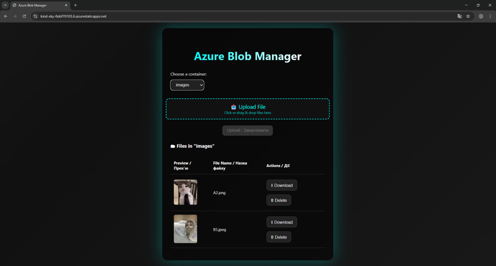

# ⚡ Azure Blob Manager — Frontend (React + Vite)



## ✨ Features (Client Side)

- Upload files via drag & drop or manual selection
- Image, audio and video previews
- Delete files with one click
- Switch between containers in a dropdown
- Responsive cyberpunk UI with dark gradient theme
- Modal previews with playback support
- Axios-powered modular API service

---

## 🧠 Overview

This is the **frontend** for a full-stack Azure Blob Storage manager.  
Built with **React** (via **Vite**) and deployed via **Azure Static Web Apps** + **GitHub Actions**.

Clean UI, production-ready design, and tight integration with a custom ASP.NET Core Web API backend.

---

## 🔌 Architecture

- **React** frontend + modular **Axios** service
- Flexible dropdown logic to switch between blob containers
- Preview modal supports image/audio/video render logic
- Absolute API URLs in production (CORS compliant)
- Deployed via GitHub Actions (`azure-static-web-apps-*`)

---

## 🚀 Local Development

```bash
npm install
npm run dev
```

---

## 🌐 Live Preview

[https://kind-sky-0ebf70103.6.azurestaticapps.net](https://kind-sky-0ebf70103.6.azurestaticapps.net)

---

## 🧩 Extensibility

You can easily:
- Add new preview types (e.g. PDF, ZIP)
- Enable user authentication (Azure AD, etc.)
- Localize UI with i18n
